# Garmin Orchestrator

Prefect orchestration for the Garmin archive. This app wraps the existing
`garmin-sync` object runners without moving SQLModel sessions, Garmin clients,
or ORM objects across task boundaries.

## Flow topology

The five Garmin ingestion deployments invoke the shared
`garmin-archive` parent flow with different schedules and default parameters.
The parent invokes one `garmin-archive-user` child flow at a time, and each
child runs its selected object branches sequentially.

The separate `notion-sync` deployment reads the archived PostgreSQL rows only;
it never calls Garmin. It runs daily at 07:00 `America/Denver`, one hour after
the morning incremental archive. Its two-day window applies to activities and
daily steps, while personal records are fully replayed so the latest record for
each Garmin `typeId` is reflected in Notion.

```mermaid
flowchart TB
    subgraph DEPLOYMENTS["Prefect deployments"]
        direction LR
        INC["incremental<br/>Scheduled 06:00 and 18:00<br/>All object types"]
        DAILY["daily-summary<br/>Manual<br/>Daily summaries only"]
        ACTIVITIES["activities<br/>Manual<br/>Activities only<br/>Details and FIT files enabled"]
        RECORDS["personal-records<br/>Manual<br/>Personal records only"]
        BACKFILL["backfill<br/>Manual<br/>All object types<br/>Dates may be supplied at runtime"]
    end

    DEPLOY_LIMIT["Each deployment<br/>concurrency limit = 1<br/>collision strategy = ENQUEUE"]
    DEPLOY_LIMIT -.-> INC
    DEPLOY_LIMIT -.-> DAILY
    DEPLOY_LIMIT -.-> ACTIVITIES
    DEPLOY_LIMIT -.-> RECORDS
    DEPLOY_LIMIT -.-> BACKFILL

    INC -->|"data_types = null"| ARCHIVE
    DAILY -->|"daily_summary"| ARCHIVE
    ACTIVITIES -->|"activities"| ARCHIVE
    RECORDS -->|"personal_records"| ARCHIVE
    BACKFILL -->|"data_types = null"| ARCHIVE

    subgraph PARENT["Parent flow: garmin-archive"]
        ARCHIVE(["garmin_archive_flow"])
        DB["1. ensure-database-ready task<br/>Connect to PostgreSQL<br/>Run Alembic upgrade to head"]
        WINDOW["2. resolve-date-window task<br/>Use explicit dates or days_back<br/>Otherwise configured lookback<br/>End defaults to yesterday"]
        TYPES["3. Normalize data types<br/>null becomes:<br/>daily summary → activities → personal records"]
        USERS["4. resolve-active-users task<br/>Optionally filter by display name"]
        USER_LOOP{{"5. For each active user<br/>sequentially"}}

        ARCHIVE --> DB --> WINDOW --> TYPES --> USERS --> USER_LOOP
    end

    subgraph CHILD["Child flow: garmin-archive-user"]
        USER_START(["Start user"])

        DAILY_SELECTED{"daily_summary selected?"}
        DAILY_LOOP["For each date<br/>sequentially"]
        DAILY_TASK["daily-summary-user-date<br/>Fetch Garmin summary → parse<br/>Upsert unless dry-run → save tokens"]
        DAILY_STATE["Inspect terminal task state<br/>Completed → result<br/>Failed after retries → error result"]
        DAILY_AGG["Aggregate all date results"]

        ACT_SELECTED{"activities selected?"}
        ACT_LIST["activity-list-user-window<br/>Fetch activity summaries for window<br/>Save tokens unless dry-run"]
        ACT_LIST_STATE{"List task completed?"}
        ACT_LOOP["For each activity<br/>sequentially"]
        ACT_SUMMARY["activity-summary-user-id<br/>Fetch full activity or use list fallback<br/>Parse → upsert unless dry-run → save tokens"]
        ACT_SUMMARY_STATE{"Summary task successful?"}
        DETAIL_SELECTED{"include_details?"}
        ACT_DETAIL["activity-detail-user-id<br/>Fetch chart and polyline detail<br/>Upsert unless dry-run → save tokens"]
        DETAIL_STATE["Inspect terminal state<br/>Failure becomes an item error<br/>Continue to FIT step"]
        FILE_SELECTED{"include_files<br/>and not dry-run?"}
        ACT_FILE["activity-file-user-id<br/>Download original FIT file<br/>Upsert file → save tokens"]
        FILE_STATE["Inspect terminal state<br/>Failure becomes an item error"]
        ACT_ITEM_AGG["Aggregate summary, detail,<br/>and FIT results for activity"]
        ACT_AGG["Aggregate all activity results"]

        PR_SELECTED{"personal_records selected?"}
        PR_TASK["personal-records-user<br/>Fetch current snapshot<br/>Parse and upsert each record<br/>Count row errors → save tokens"]
        PR_STATE["Inspect terminal task state<br/>Preserve success, partial, or error"]

        USER_RESULT["Return per-user object results"]

        USER_START --> DAILY_SELECTED
        DAILY_SELECTED -->|"yes"| DAILY_LOOP --> DAILY_TASK --> DAILY_STATE --> DAILY_AGG --> ACT_SELECTED
        DAILY_SELECTED -->|"no"| ACT_SELECTED

        ACT_SELECTED -->|"yes"| ACT_LIST --> ACT_LIST_STATE
        ACT_LIST_STATE -->|"failed after retries"| ACT_AGG
        ACT_LIST_STATE -->|"completed"| ACT_LOOP --> ACT_SUMMARY --> ACT_SUMMARY_STATE
        ACT_SUMMARY_STATE -->|"failed after retries"| ACT_ITEM_AGG
        ACT_SUMMARY_STATE -->|"success"| DETAIL_SELECTED
        DETAIL_SELECTED -->|"yes"| ACT_DETAIL --> DETAIL_STATE --> FILE_SELECTED
        DETAIL_SELECTED -->|"no"| FILE_SELECTED
        FILE_SELECTED -->|"yes"| ACT_FILE --> FILE_STATE --> ACT_ITEM_AGG
        FILE_SELECTED -->|"no"| ACT_ITEM_AGG
        ACT_ITEM_AGG -->|"next activity"| ACT_LOOP
        ACT_ITEM_AGG -->|"all activities"| ACT_AGG
        ACT_SELECTED -->|"no"| PR_SELECTED
        ACT_AGG --> PR_SELECTED

        PR_SELECTED -->|"yes"| PR_TASK --> PR_STATE --> USER_RESULT
        PR_SELECTED -->|"no"| USER_RESULT
    end

    API_LIMIT["Shared garmin-api task-tag limit = 1<br/>Serializes Garmin calls across all deployments"]
    API_LIMIT -.-> DAILY_TASK
    API_LIMIT -.-> ACT_LIST
    API_LIMIT -.-> ACT_SUMMARY
    API_LIMIT -.-> ACT_DETAIL
    API_LIMIT -.-> ACT_FILE
    API_LIMIT -.-> PR_TASK

    USER_LOOP --> USER_START
    USER_RESULT --> MORE_USERS{"More users?"}
    MORE_USERS -->|"yes"| USER_START
    MORE_USERS -->|"no"| COUNT["Count error and partial objects"]
    COUNT --> ARTIFACT["Publish garmin-archive-summary<br/>Markdown artifact"]
    ARTIFACT --> POLICY{"Errors, or partials with<br/>fail_on_partial = true?"}
    POLICY -->|"yes"| FAILED(["Fail parent flow"])
    POLICY -->|"no"| COMPLETE(["Return structured summary"])

    classDef deployment fill:#dbeafe,stroke:#2563eb,color:#172554
    classDef flow fill:#ede9fe,stroke:#7c3aed,color:#2e1065
    classDef task fill:#dcfce7,stroke:#16a34a,color:#052e16
    classDef decision fill:#fef3c7,stroke:#d97706,color:#451a03
    classDef policy fill:#fee2e2,stroke:#dc2626,color:#450a0a

    class INC,DAILY,ACTIVITIES,RECORDS,BACKFILL deployment
    class ARCHIVE,USER_START flow
    class DB,WINDOW,USERS,DAILY_TASK,ACT_LIST,ACT_SUMMARY,ACT_DETAIL,ACT_FILE,PR_TASK task
    class USER_LOOP,DAILY_SELECTED,ACT_SELECTED,ACT_LIST_STATE,ACT_SUMMARY_STATE,DETAIL_SELECTED,FILE_SELECTED,PR_SELECTED,MORE_USERS,POLICY decision
    class DEPLOY_LIMIT,API_LIMIT policy
```



Garmin-facing tasks retry up to three times with delays of 60, 300, and 900
seconds. After retries are exhausted, the child flow records an error result
and continues with independent work. Activity detail failure therefore does
not prevent the FIT download task from running. The final parent-flow policy
decides whether the collected results should fail the run.

Local flow runs:

```bash
uv run garmin-orchestrator run archive --dry-run
uv run garmin-orchestrator run daily-summary --days-back 2
uv run garmin-orchestrator run activities --days-back 7
uv run garmin-orchestrator run personal-records
uv run garmin-orchestrator run notion-sync --user mike
```

Local deployment setup:

```bash
podman compose -f compose.yaml -f compose.prefect.yaml up -d
export PREFECT_API_URL=http://127.0.0.1:4200/api
export GARMIN_POSTGRES_IMAGE=garmin-postgres:local
export GARMIN_CONNECT_ENV_FILE="${PWD}/.env"
docker build -t "${GARMIN_POSTGRES_IMAGE}" .
uv run --package garmin-orchestrator prefect work-pool create garmin-docker --type docker --overwrite
uv run garmin-orchestrator deploy
uv run --package garmin-orchestrator prefect worker start --pool garmin-docker
```

GitHub deployment setup:

The `Deploy Prefect` workflow runs on GitHub-hosted Ubuntu runners, joins the
tailnet with `tailscale/github-action`, builds and pushes a Docker image to
GitHub Container Registry, installs the uv workspace, and registers all
deployments from `prefect.yaml` to the existing `garmin-docker` Docker work
pool. It deploys on pushes to `main` that affect the orchestrator, Garmin sync
package, shared core package, Docker image metadata, or deployment metadata.
The Docker worker, work pool, network access, and any GHCR pull credentials are
managed outside this workflow.

Runtime secrets are loaded from a worker-local env file rather than GitHub
Actions secrets. The production worker exposes its Garmin env file at:

```bash
/var/lib/prefect-worker-garmin-docker/garmin-connect.env
```

`prefect.yaml` mounts the configured `GARMIN_CONNECT_ENV_FILE` into each Docker
job container at `/app/.env`, allowing the existing settings loaders to read
`DATABASE_URL` and the `NOTION_*` values documented in the root README. The
deploy workflow only passes the file path, defaulting to the production path
above. Set a repository variable named `GARMIN_CONNECT_ENV_FILE` to override
the path without changing deployment metadata.

Required GitHub secrets for the Tailscale OAuth client:

- `TS_OAUTH_CLIENT_ID` - Tailscale OAuth client ID
- `TS_OAUTH_SECRET` - Tailscale OAuth client secret

The OAuth client must be allowed to create ephemeral auth keys for
`tag:github-actions-prefect-deploy`. In Tailscale terms, grant the OAuth client
the `auth_keys` scope and the `tag:github-actions-prefect-deploy` tag.

Recommended Tailscale access:

- Tag GitHub-hosted deploy runners as `tag:github-actions-prefect-deploy`
- Tag the Prefect server as `tag:prefect-server`
- Allow only the Prefect API port from the deploy runner tag to the Prefect tag

For the default `http://prefect.svc.rockymtn.org/api` target, the API is on
TCP port `80`. If the target moves to HTTPS or direct Prefect, use only the
actual port in use, such as `443` or `4200`.

```json
{
  "tagOwners": {
    "tag:github-actions-prefect-deploy": [],
    "tag:prefect-server": ["autogroup:admin"]
  },
  "acls": [
    {
      "action": "accept",
      "src": ["tag:github-actions-prefect-deploy"],
      "proto": "tcp",
      "dst": ["tag:prefect-server:80"]
    }
  ],
  "tests": [
    {
      "src": "tag:github-actions-prefect-deploy",
      "proto": "tcp",
      "accept": ["tag:prefect-server:80"],
      "deny": [
        "tag:prefect-server:22",
        "tag:prefect-server:4200",
        "tag:prefect-server:5432"
      ]
    }
  ]
}
```

By default the workflow deploys to:

```bash
http://prefect.svc.rockymtn.org/api
```

Set a repository variable named `PREFECT_API_URL` to override that target.

The workflow tags images as:

```bash
ghcr.io/<owner>/<repo>:sha-<commit-sha>
```

Each deployment allows one active run and enqueues collisions. The deploy
workflow also configures the shared `garmin-api` task-tag concurrency limit to
`1`, which serializes Garmin API calls across incremental, manual, and backfill
runs. This protects per-user token refresh writes even when different
deployments overlap.

Activity summary, activity detail, and FIT download work run as separate
Prefect tasks so each failure boundary can retry independently. The parent flow
continues after exhausted item-level retries, publishes a
`garmin-archive-summary` Markdown artifact, and then applies the configured
error/partial failure policy.

Once Prefect deployments are active, Prefect should own scheduling. Keep
systemd for supervising the local Prefect worker instead of also running the
old direct `garmin-sync ingest run` timer.
